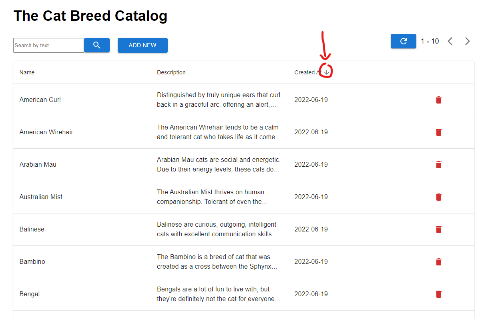
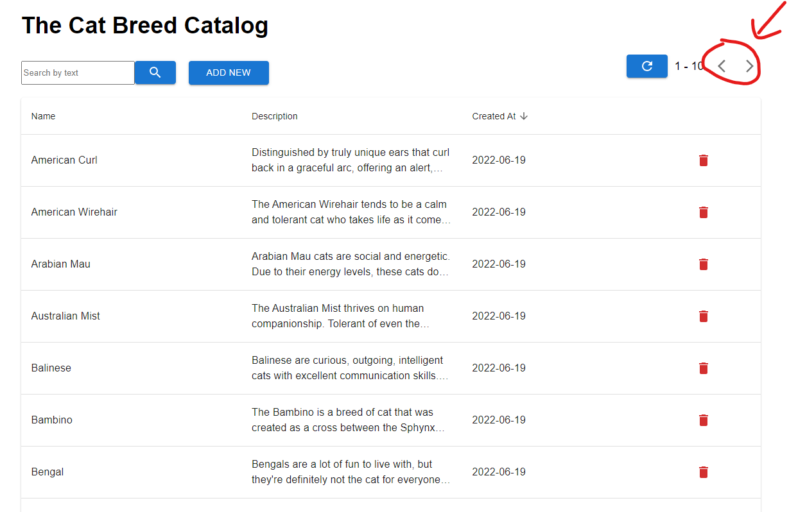
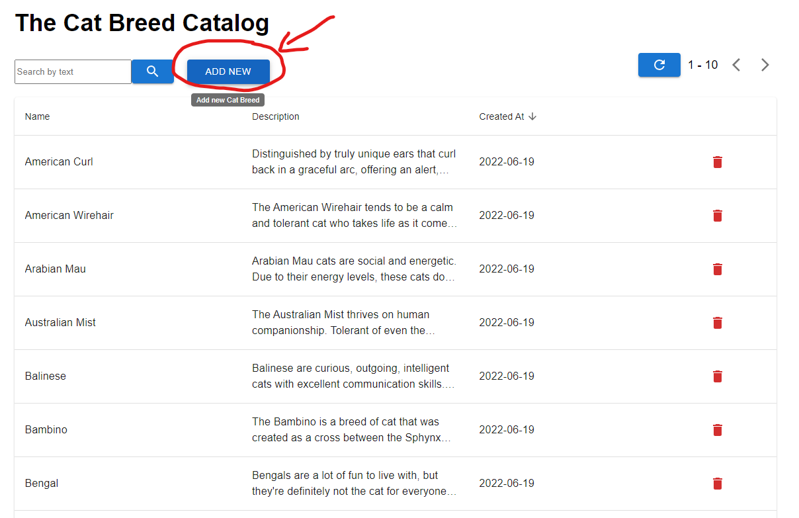
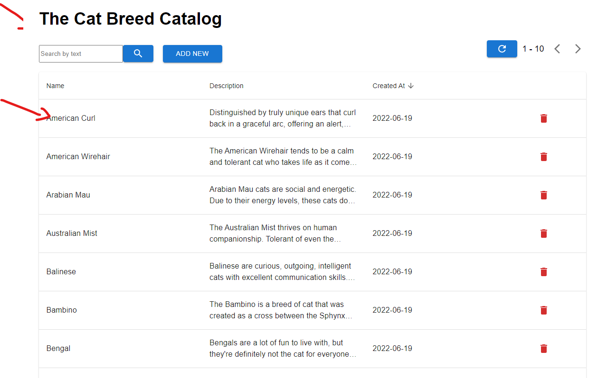
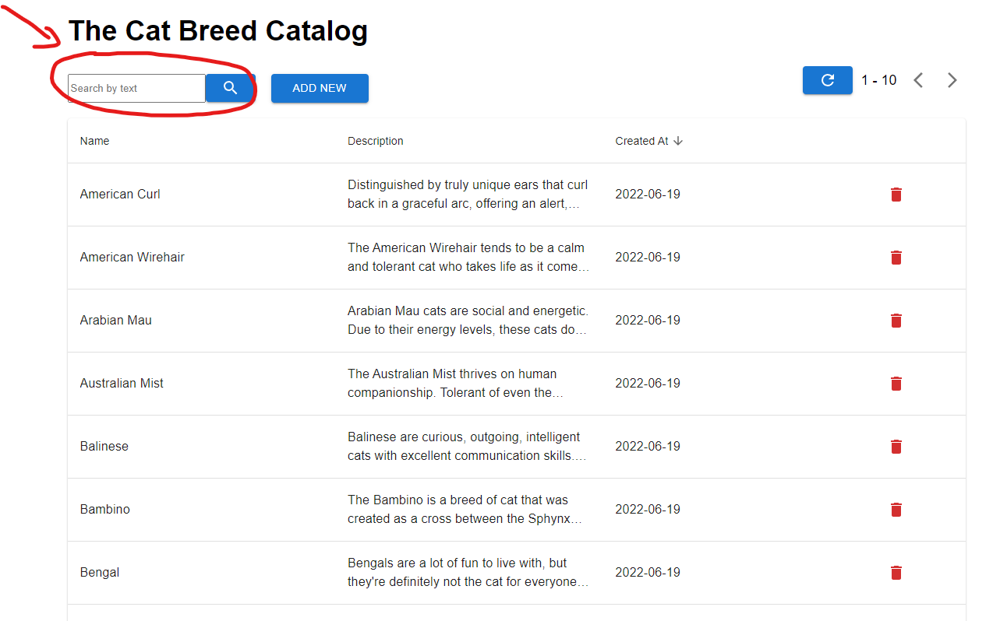
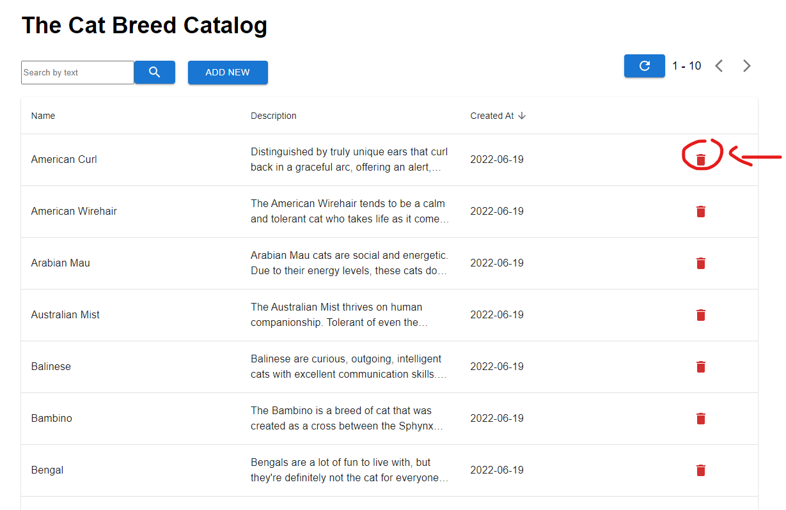

# Cat Breed DashBoard Dialog

This app fetch data from [The Cat API] (https://thecatapi.com) and allow users to interact with the data

# How to run locally

This app require to open 2 terminal to run a server and a client:

**For the server:**

you need to access the `server` folder:

`cd server`

Then you just need to install dependencies and run the app:

`npm i && npm run dev`

**For the client:**

you need to access the `client` folder:

`cd client`

Then you just need to install dependencies and run the app:

`npm i && npm run serve`

\
After that, the app is on `http://localhost:3000`

You can check the server graphql client on `http://localhost:8000/graphql`

# How to use the application

- You can refetch data from the Cat API by clicking this button.

- When click the table column name, the table data will be sorted according to the column

- Note: sorting will be base by [ASCII Table] (https://www.asciitable.com/). Sort order: 0-9 -> A-B -> a-b

- The 2 arrows will helps navigate the table

- `Add New` will open dialog to add new breed

- To edit an item, just click directly on the item row to open edit dialog

- To search cat by name, just type in this input and click the search icon

- To delete an item, click this icon

